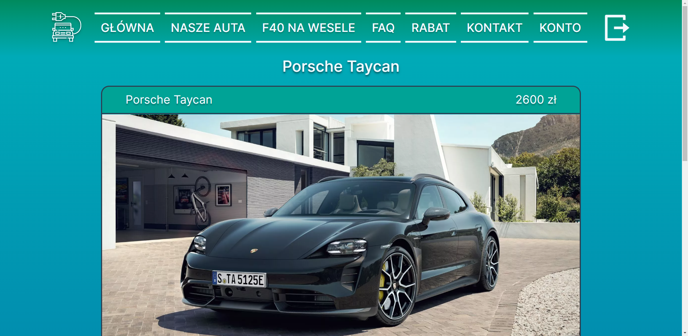
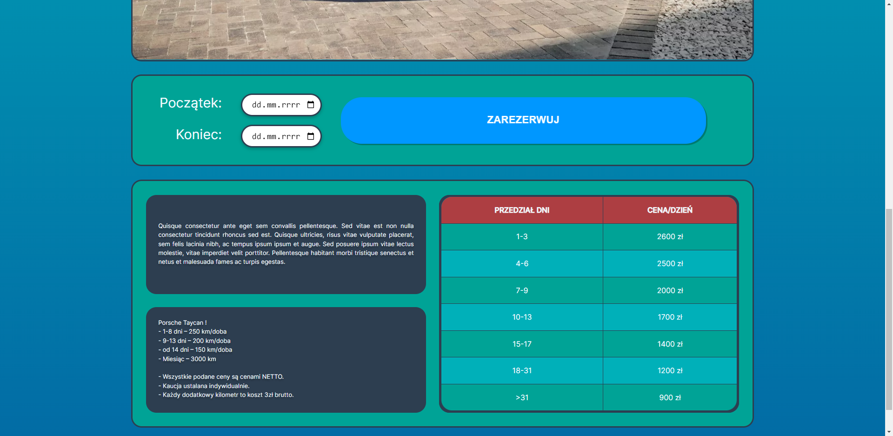
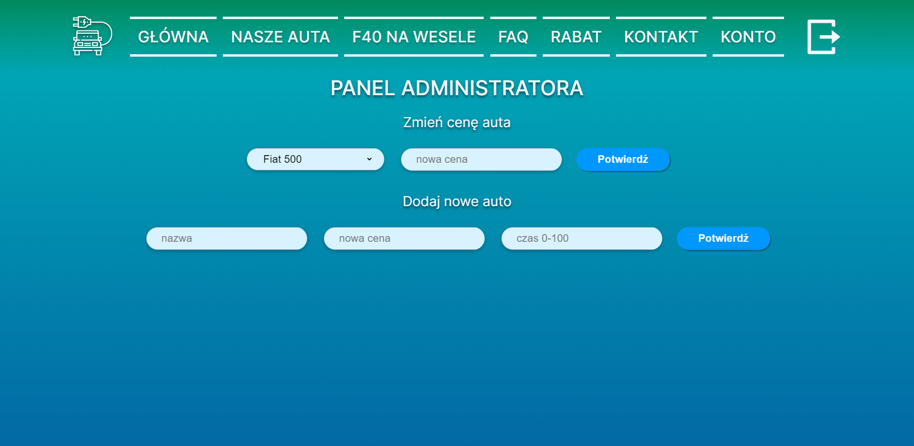

# Electric Car Rental

> Electric car rental website.

## Table of Contents

* [General Info](#general-information)
* [Technologies Used](#technologies-used)
* [Features](#features)
* [Screenshots](#screenshots)
* [Launch](#launch)
* [Project Status](#project-status)
* [Room for Improvement](#room-for-improvement)
* [Acknowledgements](#acknowledgements)

## General Information

On this page you can, among other things, check the availability of vehicles and book them. You can also view rental history and future bookings.
The administrator can add cars, change the price of current cars.

## Technologies Used

- HTML 5
- CSS 3
- PHP 7.4.0
- PostgreSQL
- Heroku
- JavaScript
- Git
- GitHub
- Docker

## Features

- The user can book a car rental through the website.
- The user can check his past and future rentals.
- The website has a car search engine operating by car name.
- The admin can change the price of the car and add new cars using the admin panel.

## Screenshots

## Launch

To run this project you need to have Docker app and some IDE like visual studio code or webstorm. First you need to run
Docker app. Then in the IDE terminal you need to write 'docker-compose up'. The last thing you have to do is open your
browser and enter 'localhost:8080' in the search bar.

## Project Status

Project is: _complete_.

## Room for Improvement

Room for improvement:

- Change the kilometer limits and personalize the prices for driving additional kilometers for each car

## Acknowledgements

Give credit here.

- This project was created as a final project in the course Introduction to Web Application Design.
- Many thanks to Adrian Widłak who oversaw the whole project.
