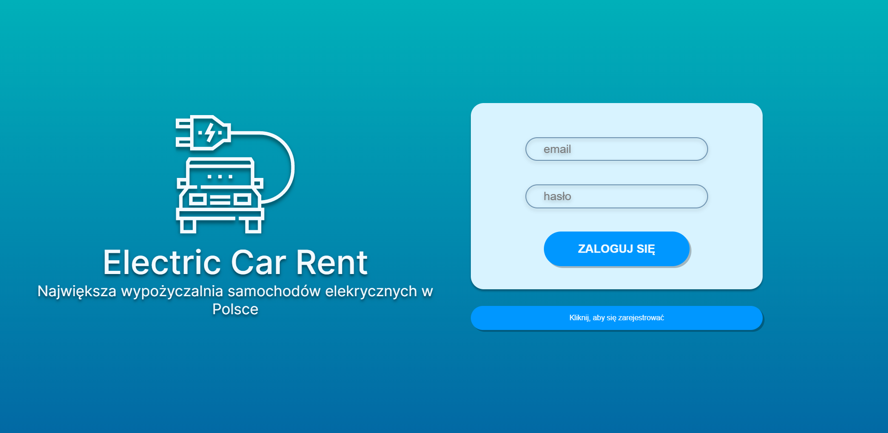
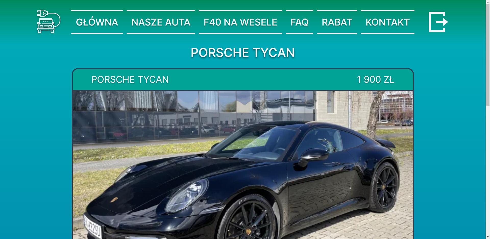
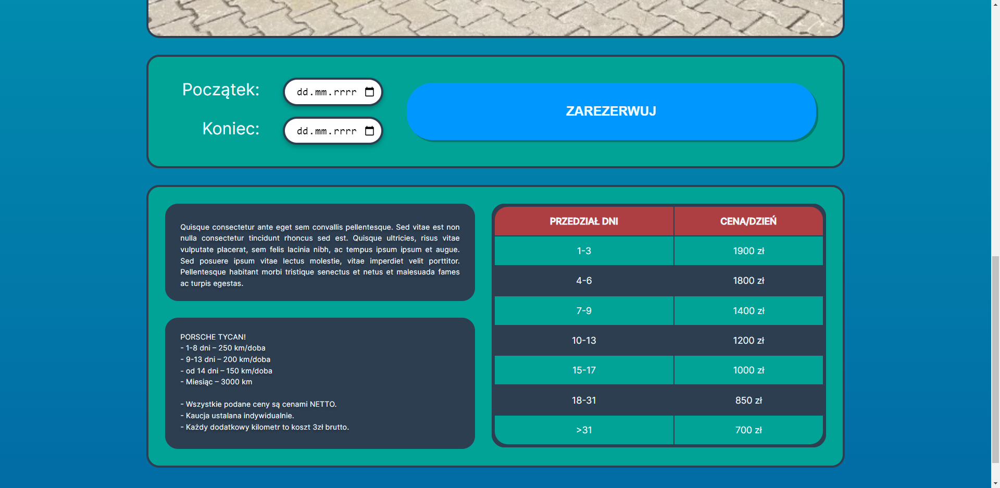

# Electric Car Rental
> Electric car rental website.

## Table of Contents
* [General Info](#general-information)
* [Technologies Used](#technologies-used)
* [Features](#features)
* [Screenshots](#screenshots)
* [Launch](#launch)
* [Project Status](#project-status)
* [Room for Improvement](#room-for-improvement)
* [Acknowledgements](#acknowledgements)

## General Information
On this page you can, among other things, check the availability of vehicles and book them. TODO

## Technologies Used
- HTML 5
- CSS 3
- PHP 7.4.0
- PostgreSQL
- Heroku
- JavaScript
- Git
- GitHub
- Docker

## Features
List the ready features here:
- Awesome feature 1 TODO
- Awesome feature 2
- Awesome feature 3

<!-- TODO -->
## Screenshots

## Launch
To run this project you need to have Docker app and some IDE like visual studio code or webstorm. First you need to run Docker app. Then in the IDE terminal you need to write 'docker-compose up'. The last thing you have to do is open your browser and enter 'localhost:8080' in the search bar.

## Project Status
Project is: _in progress_.

## Room for Improvement
Include areas you believe need improvement / could be improved. Also add TODOs for future development.

<!-- TODO -->
Room for improvement:
- Improvement to be done 1
- Improvement to be done 2

<!-- TODO -->
To do:
- Feature to be added 1
- Feature to be added 2

## Acknowledgements
Give credit here.
- This project was created as a final project in the course Introduction to Web Application Design.
- Many thanks to Adrian Widłak who oversaw the whole project.
